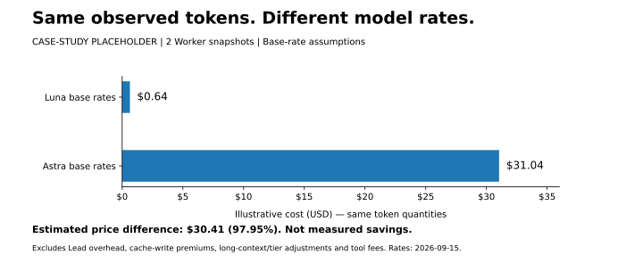

# Codex Cost-Aware SubAgent Router

**简体中文** | [English](README.en.md)

**保持主 Agent 不变，把合适的工作交给更便宜的模型。**

面向 Codex 的成本优先 SubAgent 路由 Skill：按子任务选择 **Luna / Sol / Astra + 推理强度**，可选记录验证结果与主／子 Agent token 用量。目标是降低可靠完成任务的**总成本**，而不是尽可能多创建 Agent。

当前稳定版：[**v2.5.5**](https://github.com/Aiyawoc/codex-luna-subagent-router/releases/tag/v2.5.5) · [更新记录](CHANGELOG.md) · [MIT License](LICENSE)


> **v2.5.5**：Q4 改为 Host-first / schema-aware。Codex Desktop/Core 是运行时权威，外部 `codex` CLI 仅作可选诊断；新版 canonical 和旧 V2/portable 并发表示都会归一为“同时 SubAgent 数，不含主 Agent”。

[主要作用](#purpose) · [安装／升级](#install) · [六个询问项](#setup) · [查看数据](#data) · [费用对比占位](#cost) · [更多文档](#docs)

<a id="purpose"></a>
## 主要作用

| 能力 | 解决什么问题 |
|---|---|
| **成本优先路由** | 主 Agent 保持用户指定模型；把局部实现、扫描、整理等工作下放，在复杂因果分析或专家复核时评估更高能力模型。 |
| **整组任务规划** | 一次比较全部可下放子目标；独立任务可同波执行，共享上下文的小任务可合并，有依赖或读写冲突则分波。 |
| **验证结果校准** | 可选使用本地、已验证的 outcome 调整后续建议；失败和不完整结果不会被当成成功样本。 |
| **主／子 Agent 用量统计** | 可选在子 Agent 停止、主 Agent 本轮完成时显示总量、输入、缓存命中输入和输出，保留原始数字与完整度原因。 |

### 两种策略，三层模型

| 策略 | 自动子 Agent | 适合谁 |
|---|---|---|
| **`luna_only`：极致经济** | 只使用 Luna；不够可靠的任务交还当前主 Agent。 | 希望子模型成本边界简单、可预测的用户。 |
| **`adaptive`：自动综合** | 按子任务在 Luna → Sol → Astra 中选择最低足够的模型与强度。 | 希望兼顾成本、复杂任务可靠性与独立复核的用户。 |

**Luna（经济）**承担清晰、局部、可验证的工作；**Sol（中等）**用于高歧义调试、跨模块因果、竞态等；**Astra（专家）**用于专家级架构判断和高失败代价反证。这是本项目的路由策略，不是对每项任务的性能保证。自动路由不再包含 Terra。

主 Agent 可以向下委派，也可以局部向上求助：例如 Astra high → Luna high，或 Luna max → Sol high。`max` 不等于跨模型能力升级。每个子任务最多两次尝试；每波最多 `min(3, Codex 显式并发上限)`，只扣除当前 PendingInit／Running Worker；历史 Completed 不作为累计总数占槽。**不强制开满，也不强制混用模型。**

<a id="install"></a>
## 安装／升级

### 推荐：把安装提示词交给 Agent / Codex

**v2.6.0 便携包正在 PR 验证，尚未正式发布。** 正式发布后使用下方提示词；PR 阶段仅使用用户明确指定的构建产物。不把 GitHub 的 Source code.zip 当作内置 Python 完整包。

```text
请安装或升级 Codex Luna SubAgent Router：
https://github.com/Aiyawoc/codex-luna-subagent-router

先读取仓库安装指南并识别本机系统与 CPU。
从指定正式 Release 选择 router-<版本>-<平台> 的完整包及 SHA256；
找不到对应完整包时停止并说明，不静默改装源码版或调用系统旧 Python。
可使用 $skill-installer 协助处理技能，但不能只复制 SKILL.md 或源码目录。
校验下载摘要后解压，先用 bin/router（Windows bin/router.cmd）执行 doctor --verify，
再安装完整 Skill、内置 Python 和随包 profiles，然后读取 references/codex-guided-install.md。
所有辅助脚本都通过统一启动器运行，先执行 inspect_guided_install --json，逐项询问适用缺项。
保留既有路由、并发、明确 off/false、outcome/usage 数据及其它配置。
旧 hooks 切换私有解释器时仍在第 6 项询问，并交由客户端审查信任；不要自行授信。
不要修改系统 Python、PATH 或在 hooks 运行时下载依赖。
```

### 备用：手动安装完整平台包

下载与 CPU 对应的完整包及摘要并校验，解压到已安装 Skill 目录之外。macOS 使用：

```bash
cd /解压目录/codex-luna-subagent-router
./bin/router doctor --verify
bash ./install.sh --global
```

Windows 原生 PowerShell 使用（不要求 Python 或 Bash）：

```powershell
cd C:\解压目录\codex-luna-subagent-router
.\bin\router.cmd doctor --verify
.\bin\router.cmd install --global
```

也可使用 `./install.ps1 --global`；不自动绕过本机执行策略。项目安装将 `--global` 改为 `--project <项目路径>`。安装后读取输出的实际安装路径，继续完成六项问答；已有 hooks 不会被静默改写或授信。

完整包包含固定版 CPython 3.13.15。源码开发另需显式选择合格解释器，不能当作普通用户安装路线。详见 [便携运行环境与升级](skills/codex-luna-subagent-router/references/portable-runtime.md)。

<a id="setup"></a>
## 安装引导：六个询问项

| # | 询问项 | 功能与选择 |
|---|---|---|
| 1 | **Default 模式结构化提问** | `default_mode_request_user_input`：当前客户端支持时，允许在 Default 模式使用结构化提问工具。实验性；未开启仍可普通文字提问。 |
| 2 | **长期自动委派授权** | 全局／当前项目／不安装。决定主 Agent 是否可在有成本或验证价值时自动委派；不扩张工具权限。 |
| 3 | **路由策略** | `luna_only` 极致经济，或 `adaptive` 自动综合。主 Agent 本身不会被切换。 |
| 4 | **最大并发子 Agent 数** | 保持当前／Codex 默认、推荐 3，或自定义正整数。以当前 Codex Host/Core 为权威；CLI 非必需。canonical/legacy V2/portable 都归一为“不含主 Agent的同时 SubAgent 数”。 |
| 5 | **验证结果校准** | 仅 `adaptive`：`conservative`／`off`。使用同类已验证历史保守调整建议；缺失时运行默认 off，但升级引导必须询问。 |
| 6 | **主／子 Agent token 统计与完成摘要** | on／off；开启时选择支持且受信任的自动 hooks，或手动采集。统一涵盖 `UserPromptSubmit`、`Stop`、`SubagentStart`、`SubagentStop`，不再单设第 7 项。 |

**升级规则：缺失不等于拒绝，明确关闭不等于缺失。** 所有适用缺项必须明确询问；已有 off／false 保留。旧版仅开启子 Agent 统计，扩展到主线程前也在第 6 项询问。`--hooks-supported` 是操作者已核实能力的声明，不是自动检测，更不是信任绕过。

### v2.5.4：并发恢复与 Worker 复用

“最大并发 3”不是“一个对话只能创建 3 个”。支持 `list_agents` 时，规划只统计 PendingInit／Running；Completed／Errored／Interrupted／Shutdown 属于历史或可回收状态。创建失败必须区分 `agent thread limit reached` 和真正的 `server overloaded`，不能统称“模型满载”。

同一工作流继续处理、实际模型／强度已知且满足要求、无需独立复核时，可以复用 Completed Worker；否则仍使用 fresh Worker。复用不改变模型／强度，token 只计算本轮新增区间。

### v2.5.5：Host-first 并发兼容

Router 运行时依赖 **Codex Host/Core** 暴露的 SubAgent、hooks 与 rollout 能力，不依赖 PATH 中的 `codex` CLI。Codex Desktop 与 CLI 可能是不同 build，因此安装引导不再把 CLI 版本当作 Desktop schema 的唯一依据。

`configure_subagent_limit.py --schema auto`：已有 canonical 配置时保持 `[agents].max_concurrent_threads_per_session = N`；Host schema 无法确认的新配置则写 portable 兼容表示（旧 `agents.max_threads = N` + 旧 V2 internal `max_concurrent_threads_per_session = N+1`）。`inspect_guided_install.py` 会识别这些等价表示并发现冲突。Codex CLI 0.154.0 已支持 canonical 字段，但 CLI 只作为可选诊断器。

<a id="data"></a>
## 查看数据

先以安装器输出为准定义已安装 Skill 的路径；升级会复用明确的旧位置。下面是默认全局路径；项目安装请使用 `<项目>/.agents/skills/codex-luna-subagent-router`。从**你的工作项目目录**调用脚本，不要为查看数据切换到 Skill 目录。

```bash
SKILL="${CODEX_SKILLS_DIR:-$HOME/.codex/skills}/codex-luna-subagent-router"

# 1. 验证结果：成功／失败／partial、未结算回执、可用校准建议
"$SKILL/bin/router" route_advisor stats

# 2. 子 Agent：模型／强度与四项 token 用量
"$SKILL/bin/router" token_usage stats

# 3. 主 Agent：各轮主线程及可靠关联子线程的本轮用量
"$SKILL/bin/router" turn_usage stats

# 准备最终回复时的正文前快照（仅当前 scope 恰有一个 active turn 时成功）
"$SKILL/bin/router" turn_usage preview

# 4. 安装／升级还缺哪些明确选择（只读）
"$SKILL/bin/router" inspect_guided_install --json
```

每个 `stats` 都可加 `--json` 输出原始整数和明细。常用筛选：

```bash
# 当前项目的 outcome
"$SKILL/bin/router" route_advisor stats --current-scope --json

# 某个父会话的子 Agent；替换为真实会话 ID
"$SKILL/bin/router" token_usage stats --parent-id ACTUAL_PARENT_ID --json

# 某个主会话的逐轮摘要
"$SKILL/bin/router" turn_usage stats --session-id ACTUAL_PARENT_ID --json
```

默认数据目录：`${CODEX_HOME:-$HOME/.codex}/state/codex-luna-subagent-router/`。

| 文件 | 内容 |
|---|---|
| `outcomes.jsonl` | Lead 验收后的质量结果；token hooks 不自动替代验收。 |
| `outcomes.jsonl.receipts.jsonl` | `begin` 登记的任务回执；用于幂等 `finalize` 与 pending 检查。 |
| `usage.jsonl` | 子线程的用量快照；按每个子线程取最新记录，**不能直接把每行相加**。 |
| `usage.turns.jsonl` | 主会话每轮起点、主线程自身用量与可靠关联的子线程增量。 |

`CODEX_LUNA_ROUTER_REGISTRY` 可覆盖 outcome 路径；`CODEX_LUNA_ROUTER_USAGE` 可覆盖 usage 路径。数据应一起备份，不因更新 Skill 删除。

示例显示（非实测）：

```text
Luna high | 总量 45k | 输入 42k（缓存命中 30k）| 输出 3k tokens | 完整快照
```

`k / m / b` 分别表示千／百万／十亿；缓存是输入子项，推理是输出子项，都不重复加总。**完整快照、待确认、部分统计、不可用是用量完整度，不是任务质量评分。** 缺失值为 null，不是 0。详细诊断看 JSON 的 `snapshot.reasons`。

<a id="cost"></a>
## Token 与费用对比（案例占位）

> **这是一块待补充正式案例的占位区，不是已证明的产品收益。** 暂用维护者提供的两条真实、但均为 `partial` 的 Luna high 快照演示计算；已移除会话 ID 和个人路径。下面只比较“相同已知 token 按两种单价重算”的估值，不表示 token 数减少，也不表示订阅账单实际节省。

### 已观察到的 token

| 样本 | 观察模型／强度 | 总量 | 输入（含缓存） | 其中缓存命中 | 输出 |
|---|---|---:|---:|---:|---:|
| Worker 1 · partial | Luna high | 9,554,053 | 9,522,324 | 8,983,040 | 31,729 |
| Worker 2 · partial | Luna high | 9,597,268 | 9,552,106 | 9,188,608 | 45,162 |
| **已知合计** | **2 个 partial** | **19,151,321** | **19,074,430** | **18,171,648** | **76,891** |

### 单价假设与重算

采用官方模型页列出的**标准、短上下文基础文本价格**，核对日期 **2026-09-15**；单位 USD／百万 token。价格会变化，正式案例应重新核对 [Luna 定价](https://developers.openai.com/api/docs/models/gpt-5.6-luna) 和 [Astra 定价](https://developers.openai.com/api/docs/models/gpt-6-astra)。

| 用于本例的单价 | 未缓存输入 | 缓存命中输入 | 输出 |
|---|---:|---:|---:|
| Luna | $0.20 | $0.02 | $1.20 |
| Astra | $10.00 | $1.00 | $50.00 |

```text
估值 = [(输入 − 缓存命中) × 输入单价
      + 缓存命中 × 缓存单价
      + 输出 × 输出单价] / 1,000,000
估计价差 = 按 Astra 重算的估值 − 按 Luna 重算的估值
```

| 样本 | 按 Luna 基础价重算 | 同量按 Astra 基础价重算 | 估计价差 |
|---|---:|---:|---:|
| Worker 1 | $0.33 | $15.96 | $15.64 |
| Worker 2 | $0.31 | $15.08 | $14.77 |
| **已知合计** | **$0.64** | **$31.04** | **$30.41** |



**在本例的同量 token 和基础单价假设下，估计价差约 $30.41（97.95%）。** 使用未舍入值计算后再展示；这不是“已省下 $30.41”的实测结论。Astra 并未实际执行同一任务，可能产生不同 token 数、缓存命中和质量结果；Lead 编排、复核、返工的成本也未扣除。

本例还**排除了缓存写入附加费用、长上下文倍率、Fast／Batch／Flex、地区加价及工具费**。现有汇总缺少这些逐请求计费字段，不能把排除项当成已确认的 0；尤其不能用累计 19.2m 判断每次请求是否进入长上下文价档。模型页说明了这些差异，因此本表只是条件化估值。

原始匿名计数、单价与假设见 [对比数据](docs/examples/cost-comparison.json)；重算方式与正式案例模板见 [费用对比说明](docs/cost-comparison.md)。正式案例补齐前，不把该示例百分比当作产品宣传承诺。

<a id="docs"></a>
## 更多文档与边界

| 文档 | 内容 |
|---|---|
| [安装与升级指南](skills/codex-luna-subagent-router/references/codex-guided-install.md) | 六项问答、缺项盘点、配置与钩子信任。 |
| [路由策略](skills/codex-luna-subagent-router/references/routing-policy.md) · [任务规划](skills/codex-luna-subagent-router/references/work-planning.md) | 能力差距、精确绑定、整组任务和并发约束。 |
| [Outcome 采集](skills/codex-luna-subagent-router/references/outcome-collection.md) | begin／finalize、保守历史校准与采样限制。 |
| [便携 Python 与完整包](skills/codex-luna-subagent-router/references/portable-runtime.md) | 私有解释器、四平台包、升级与 hooks 审查。 |
| [Token 统计](skills/codex-luna-subagent-router/references/token-accounting.md) | hooks、手动采集、统计口径、完整度和本轮归属。 |
| [v2.5.5 Desktop 实机验收](docs/v2.5.5-desktop-acceptance.md) | Host-first Q4、实时并发、parent/child token、Worker 复用与 preview/Stop 收口。 |
| [更新记录](CHANGELOG.md) · [v2.5.4 设计](docs/v2.5.4-runtime-lifecycle-accounting.md) | 版本变化和已知实机边界。 |

Worker 为叶子节点，不再派生下级、不扩张权限；实际模型身份不能用 Worker 自述代替。Prompt 规则与本地校验不是引擎级强制执行。未登记的 Worker、缺失日志或不支持的客户端格式都可能降低覆盖率；本地测试不能证明真实账单、自然委派率或端到端净节省。

开发验证（完整源码目录）：

```bash
cd skills/codex-luna-subagent-router
python3 scripts/validate_route_plan.py examples/route-plan.valid.json --notice
python3 -m unittest discover -s tests -v
```

项目基于 [MIT](LICENSE) 开源；致谢与上游参考见 [NOTICE](NOTICE.md)。
